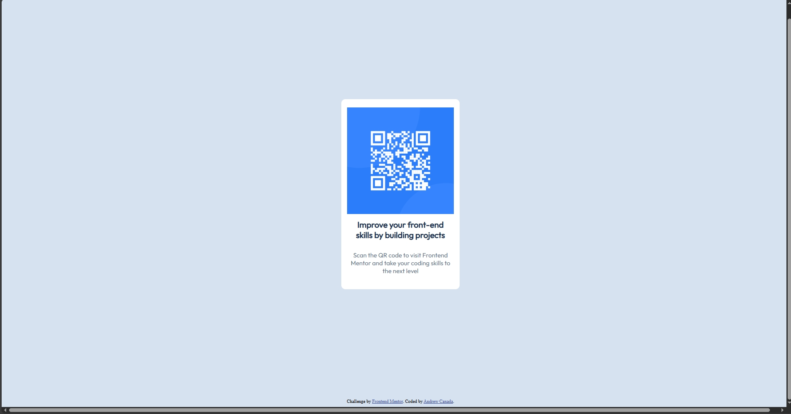

# Frontend Mentor - QR code component solution

This is a solution to the [QR code component challenge on Frontend Mentor](https://www.frontendmentor.io/challenges/qr-code-component-iux_sIO_H). Frontend Mentor challenges help you improve your coding skills by building realistic projects. 

## Table of contents

- [Overview](#overview)
  - [Screenshot](#screenshot)
  - [Links](#links)
  - [Built with](#built-with)
- [Author](#author)

## Overview
- This is my attempt at the QR component challenge. I've tried to make it responsive so it works both for mobile and desktop.
### Screenshot
- Desktop: 

-Mobile:

### Links

- Solution URL: [https://github.com/CanadaAndrew/QRCode]

### Built with

- Semantic HTML5 markup
- CSS custom properties
- Flexbox

## Author

- Website - [Andrew Canada](https://github.com/CanadaAndrew)
- Frontend Mentor - [@CanadaAndrew](https://www.frontendmentor.io/profile/CanadaAndrew)